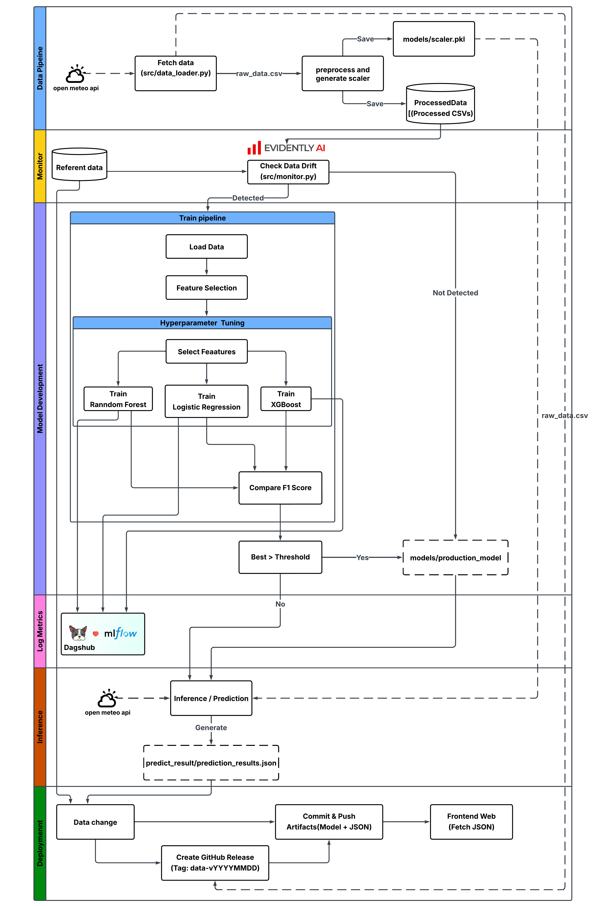

# 🌊 FloodOps: End-to-End MLOps Flood Prediction System

**FloodOps** is an automated machine learning pipeline designed to predict flood risks in the Chao Phraya River basin 7 days in advance. The system implements a complete **MLOps lifecycle**, featuring automated data ingestion, drift detection, self-healing retraining loops, and continuous deployment to a web frontend.

---

## 📋 Project Overview

Traditional static models suffer from "Model Decay" as weather patterns change. FloodOps solves this by:
1.  **Fetching live data** daily from Open-Meteo API.
2.  **Monitoring data quality** using Evidently AI to detect distributional shifts (Data Drift).
3.  **Automatically retraining** the model only when significant drift occurs.
4.  **Deploying results** to a React frontend via automated Git workflows.

---

## 🏗️ System Architecture

The entire pipeline is orchestrated by **GitHub Actions**, running daily at midnight (UTC).

## ✨ Key Features

### 1. Intelligent Monitoring (Drift Detection)
Instead of simple rule-based checks, we use **Evidently AI** to compare the distribution of new data against the training baseline.
* **Relaxed Threshold:** Implements a dynamic threshold to accept seasonal drift, preventing false alarms.
* **Smart Imputation:** Automatically fills missing data with "Monthly Mean" values to maintain data integrity.

### 2. Automated Retraining Pipeline
When significant drift is detected, the system triggers `src/train.py` to execute a full training suite:
* **Feature Selection:** Automatically identifies and selects the top 10 most important features.
* **Hyperparameter Tuning:** Runs Grid Search across XGBoost, Random Forest, and Logistic Regression.
* **Auto-Promotion:** Evaluates models based on F1-Score and automatically promotes the winner to production.

### 3. Data Versioning & Traceability
* **Git Tagging:** Every data update triggers an automated Git Tag (e.g., `data-v20251125`).
* **GitHub Releases:** Raw data files (`raw_data.csv`) are automatically attached to releases, creating a permanent, downloadable history of the dataset.

---

## 📂 Project Structure

```text
Flood_Prediction/
│
├── .github/workflows/   # GitHub Actions (Automation Logic)
│   └── smart_pipeline.yml
│
├── data/
│   ├── raw/             # Raw historical weather data (Versioned)
│   └── preprocess_data/ # Processed data ready for training
│
├── models/              # Model Artifacts
│   ├── production_model.json  # The active model used for inference
│   ├── scaler.pkl             # Standard Scaler for data normalization
│   └── drift_report.html      # Latest visual data drift report
│
├── src/                 # Source Code
│   ├── data_loader.py   # Fetches data from Open-Meteo API with Retry logic
│   ├── preprocess.py    # Cleans data, generates features, and creates scaler
│   ├── monitor.py       # Checks for Data Drift using Evidently AI
│   ├── train.py         # Trains, tunes, and registers the best model
│   └── predict_daily.py # Generates 7-day forecast JSON
│
├── predict_result/      # JSON Output storage
├── web/frontend/        # React Frontend Application
└── requirements.txt     # Python Dependencies
```
# 📊 Monitoring & Results
- **Prediction Output**: The system generates prediction_results.json containing flood probabilities and risk levels for the next 7 days.

- **Drift Report**: A visual HTML report (drift_report.html) is generated daily to visualize how feature distributions change over time.

- **Experiment Logs**: Track training metrics (F1-Score, Accuracy, Parameters) directly on DagsHub.

# 👥 Contributors
## CPE393 Machine Learning Operations Project
- Natchanon Phattamanuruk  65070501018 `Data Pipeline/Scientist`
- Teerawut Ployjindamanee  65070501031 `ML Deployment`
- Napat Sinjindawong  65070501074 `ML Engineer/Model Training`
- Nutchanon Boonyato 65070501075 `MLOps/DevOps Engineer`